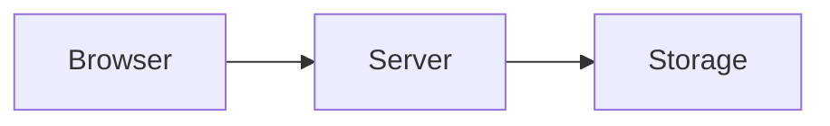

# Writing blog posts

Add a Markdown file to `src/content/blog`. Its filename becomes the URL slug.
Include `title`, `date` (YYYY-MM-DD), `summary`, comma-separated `tags`, and
`readingTime` in the existing frontmatter format.

Use a fenced `mermaid` block for a diagram. The article renderer loads Mermaid
on demand, applies the site's dark theme, and retains a collapsible source view.
Wide diagrams scroll within the article. If rendering fails, the source stays
visible. Ordinary code fences remain code blocks.

Give each diagram an accessible title and description:

````markdown

````

See the [Mermaid documentation](https://mermaid.js.org/config/usage.html)
for API and configuration details. Keep the surrounding prose useful on its own,
and update the reading time when expanding an article.

Run `npm run build` to check the production bundle. Open each changed post in
the browser to check diagram syntax, readable labels, and narrow-screen scrolling;
the build alone does not render Mermaid graphs.
