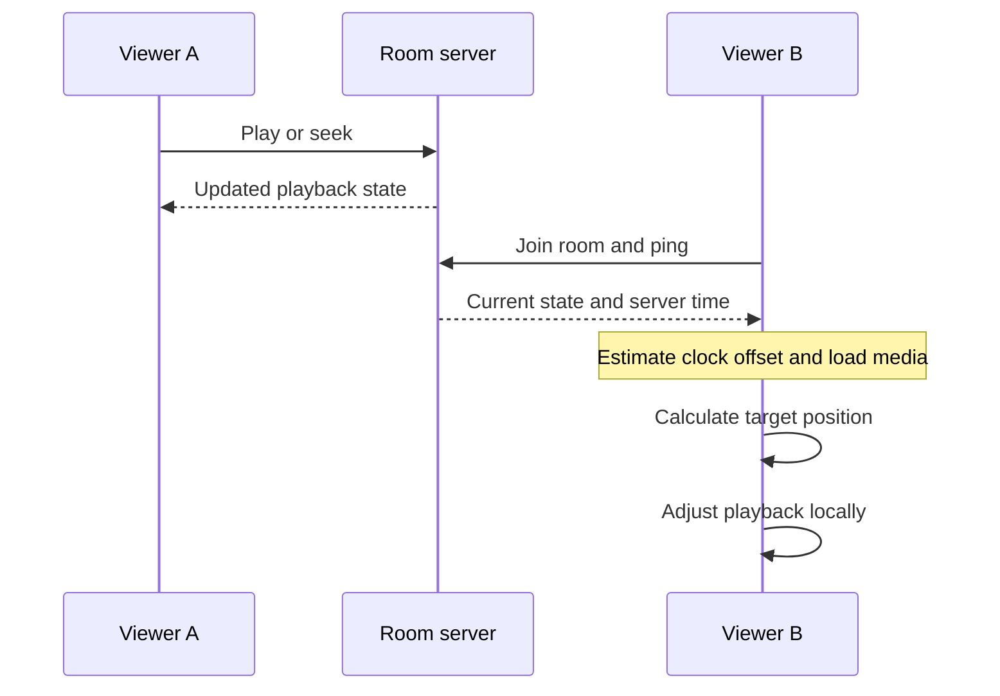
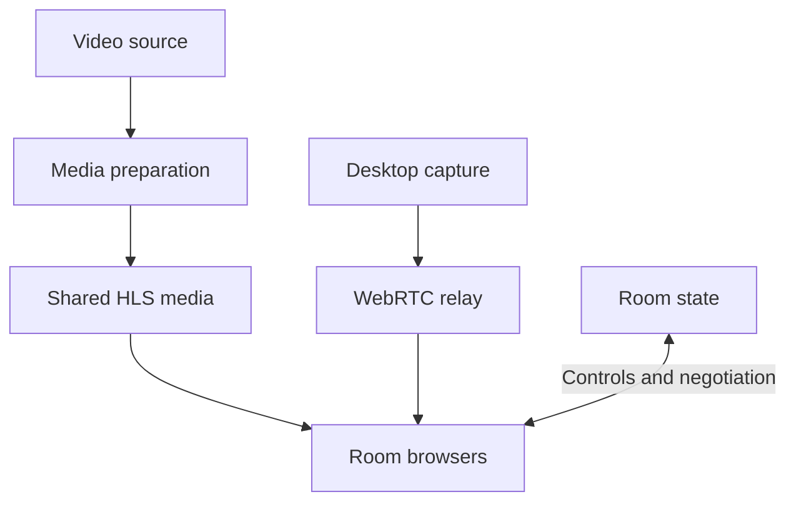

Helltube is my watch-together app, built with Svelte and Node.js. People join a room, add videos to a shared queue, and control playback together. It also supports desktop sharing, shared files, and reactions drawn directly over the picture. Behind that fairly casual interface is a specific engineering problem: every browser needs to agree on what the room is doing while still handling its own connection and playback quirks.

Each room has one authoritative playback clock on the server. Its state includes a position, a timestamp, whether playback is paused, and a revision. Clients estimate their offset from the server clock and use that state to work out where the video should be now. Small differences can be corrected with a slight playback-speed adjustment; larger differences require a seek. A late joiner gets the current room state and catches up from there.

The clock estimate comes from ping responses. The client measures the round-trip time, estimates the server offset against the midpoint of that trip, and keeps the lowest-latency sample from its latest twelve measurements. That reduces the influence of a response held up in transit, although an asymmetric connection can still introduce error. Once the offset is known, the basic timeline calculation is the saved position plus elapsed server time, with additional handling for duration limits and skipped segments. Paused playback contributes no elapsed time.

The correction thresholds make that policy concrete. A difference greater than one second triggers a seek. Between 150 milliseconds and one second, the player runs at 1.03 times normal speed when behind or 0.97 when ahead. Below 150 milliseconds it returns to normal speed. Those thresholds balance visible jumps against how long a player takes to converge. The client also rejects room snapshots older than the version it has already accepted, keeping stale state from replacing a newer view of the room.

Video preparation is part of that model. The backend uses tools including yt-dlp and FFmpeg to prepare shared HLS media, so playback can begin before a whole source video has downloaded. The room timeline waits for media readiness. Meanwhile, an individual viewer's volume, autoplay restrictions, or recovery from a delivery problem belong to that browser. A local recovery should not unexpectedly move the timeline for everybody else.

Desktop sharing has different requirements. It uses WebRTC through a mediasoup relay: the sharer sends one encoded stream to the server, which forwards it to viewers. That keeps the sharer's upload from multiplying with the audience, although the server still needs outbound bandwidth for each viewer. Live desktops do not have a seekable timeline. When someone starts sharing, the interrupted video keeps its place in the queue; videos and live shares can also coexist, with desktops appearing as thumbnails while a video plays.

The relay forwards a single video encoding to all viewers. It avoids a separate encoder per recipient, but a slower viewer cannot choose an independently encoded lower-quality layer. Each browser's media connection is encrypted to the relay, which terminates that encryption; this is not end-to-end encryption between viewers. The media connections also use their own network listener. A working web page and WebSocket connection alone do not establish that the live-media route is reachable.

The room has a playful side, too. The whiteboard sends drawing coordinates as people sketch over the player, and late joiners receive the current board. Shared files have their own persistent storage and resumable uploads. Those features need different lifetimes: a drawing can disappear when a room empties, while an uploaded file should survive a server restart. Even frontend updates account for that distinction, waiting while a browser still holds unfinished upload files or an active screen share.

SQLite keeps durable room state and playback checkpoints. On restart, the room restores its position with the timeline paused while media readiness is recovered, so time spent offline does not silently advance the video. Live membership and desktop captures are recreated separately. A desktop capture cannot be restored from a database row: the browser must ask for permission and start a new capture. The saved room instead retains the interrupted video and queue as its resumable state.

The same distinctions guide verification. Clock and room rules can be checked with controlled time and explicit state changes. Browser checks exercise reconnecting, late joins, and shared controls; media checks cover the preparation path. These checks support specific behaviors, while playback quality still depends on the source provider, the delivery path, and each viewer's device. Keeping those causes separate makes a stalled video much easier to diagnose.

Helltube brings those systems together around a room people can spend time in. The queue, playback clock, live streams, and temporary reactions each have their own rules, but the interface has to make them feel coherent. I also embed Helltube in [Strife](/blog/strife), alongside native Mumble voice and chat.
