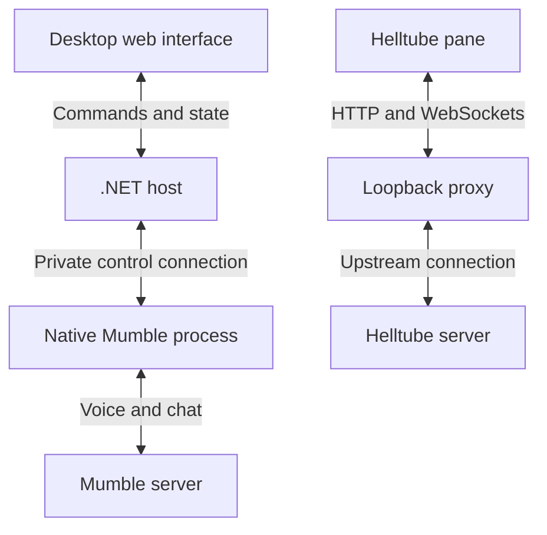
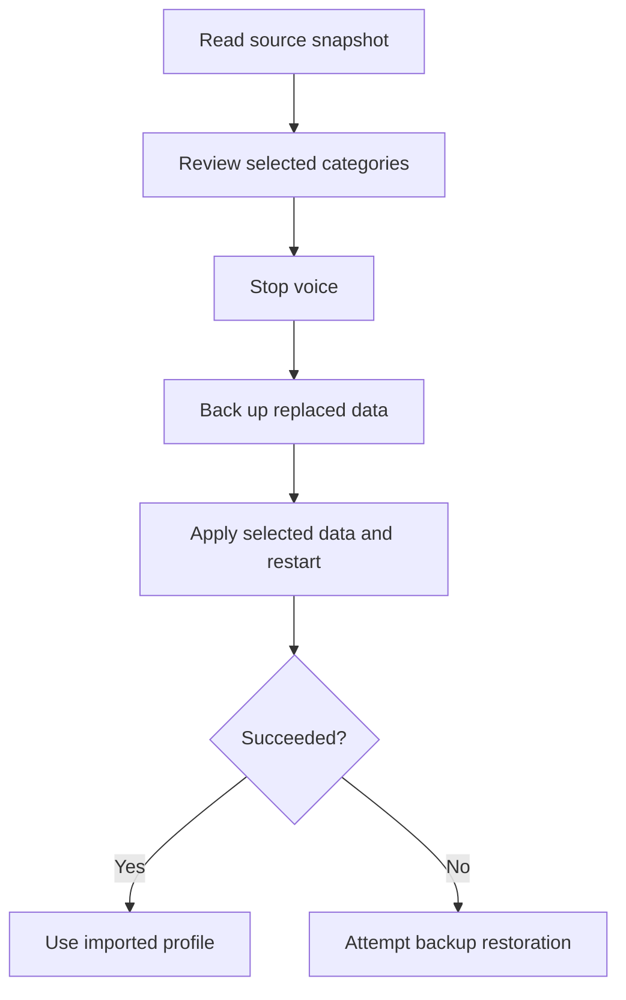

Strife combines a Mumble voice client with [Helltube](/blog/helltube) in one desktop workspace. Voice rooms and user controls sit beside chat and shared video. The panels can be docked, floated, resized, or collapsed, so the layout can follow what the group is doing. Moving a panel preserves the chat draft and the embedded Helltube session.

The desktop host is written in C# with .NET and PhotinoX. Its web interface handles presentation, while a separate native process runs Mumble's audio and networking code. Capture, Opus encoding, encryption, jitter buffering, and global shortcuts stay with Mumble. A small control adapter exposes actions such as connecting, joining a channel, muting, and sending chat, and sends channel and user state back to the host. Audio samples never travel through the web interface.

The local connection is deliberately narrow. On Windows, the host creates a random named pipe restricted to the current user and supplies a per-launch authentication token to the child process. On macOS and Linux, the corresponding transport is a Unix socket inside a private directory. Commands and events are newline-delimited JSON, with bounded frames and serialized writes. The Qt adapter handles commands on Mumble's GUI thread and publishes changed channel and user state on a 100 millisecond timer.

A command acknowledgement and a completed connection mean different things. Accepting a connect command confirms that the engine can process it; the UI becomes connected only after Mumble assigns the local session. Certificate prompts, authentication errors, and server restrictions still come from the native client. Preserving that distinction prevents the shell from reporting success while the actual connection is still waiting on a password or a trust decision.

That division makes useful desktop behavior available without recreating an audio client in JavaScript. Push to talk uses Mumble's native shortcut engine, including when another application has focus. Audio settings open the native settings dialog, and new Strife profiles start with RNNoise selected. The desktop owns the voice process through an authenticated local connection; closing the host or losing that connection shuts the engine down. Reloading the interface can restore the current voice state without reconnecting to the server.

The shell itself is served from a random loopback port. Native commands require the expected top-level shell URL and a per-launch capability token. The embedded Helltube page receives neither that token nor a relay into the native bridge. Incoming Mumble chat is exported as text and validated link ranges, then rendered with text nodes and anchors. This keeps rich content received from a voice server from becoming arbitrary HTML inside the privileged desktop interface.

Embedding Helltube takes more than placing an iframe beside the channel list. Remote login cookies and a local desktop origin have to work together. Strife uses a separate loopback proxy for Helltube's HTTP and WebSocket traffic, with cookies isolated by upstream server. The video pane stays separate from the shell's native controls. Mumble and Helltube retain their own accounts and connection lifecycles, so losing video does not also disconnect voice.

The shell and proxy have distinct origins because they use different ports, while remaining on the same loopback address for same-site cookie behavior. The proxy preserves HttpOnly and SameSite attributes, checks the browser's Origin, and verifies upstream HTTPS certificates. Media and uploads stream through it, including byte-range requests. It also rewrites media locations that need to pass back through the local origin. That is enough integration to keep login and playback working without merging Helltube accounts with Mumble identities.

Existing Mumble users can review and import settings, saved server data, and certificate identity. Keeping that identity matters because it preserves server registrations. The importer stages a snapshot, backs up the data it will replace, and attempts restoration if applying the import or restarting voice fails. It also keeps saved server passwords out of the web interface.

Importing a live SQLite database needs a consistent snapshot, including committed data still in its write-ahead log. Review exposes availability and counts, while the native host retains credentials. When a saved server is selected, the host verifies that it still matches the requested endpoint before resolving its password. Settings, server data, and identity are separate choices, so a user can bring over a certificate without replacing an entire audio setup.

Much of Strife's work lives in these transitions: rearranging panels without losing state, reloading a view without interrupting a call, and opening native dialogs in the right window. The source includes integration checks using real voice engines and an isolated Mumble server, plus desktop checks for the embedded Helltube session. Those boundaries are what let voice, chat, and video share a window while remaining independently useful.
