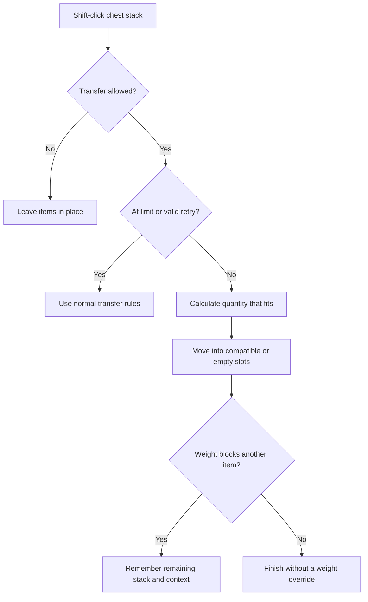
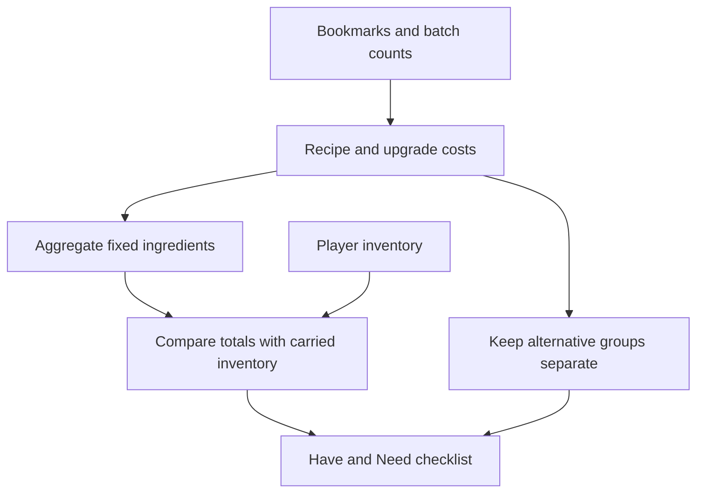

Mineheim and AddAid are my two client-side Valheim mods. Mineheim brings Minecraft-style mouse controls to the inventory. AddAid adds recipe information and a persistent crafting checklist. Both are C# plugins for BepInEx 5, and neither requires a server-side mod. They focus on actions repeated throughout a session: moving materials, finding their uses, and remembering what to gather next.

Mineheim supports familiar gestures such as right-clicking to pick up half a stack, dragging with the right button to place one item per slot, and double-clicking to collect compatible items. Scroll-wheel transfers move individual items between a chest and the player. Middle-click combines compatible stacks; in a chest it also sorts and packs items, while the player's surviving stacks keep their positions so the hotbar stays arranged.

The interesting part is preserving the meaning of every item through those gestures. Valheim's cursor reserves items in their source inventory. A split stack therefore has both a held portion and a visible remainder, and collection, merging, swapping, and sorting all have to respect that split. Closing the inventory returns unplaced items to their source. Stack limits, item compatibility, quest restrictions, and container access still govern what can move.

For example, merging 20 held wood into a slot containing 45 leaves 50 in that slot and 15 on the cursor. If the held wood came from a split stack, its visible source remainder stays where it was. Swapping a split stack with an incompatible item is more involved: the newly held item needs a backing slot. When neither inventory has room for that backing stack, the swap leaves everything unchanged. The same visible gesture can therefore follow different rules depending on where the cursor's items are reserved.

One small interaction captures the approach: Shift-clicking a chest stack first transfers only what fits under the carry limit. If the player is carrying 297 out of 300 weight and each item weighs 2, that click moves one item. A second Shift-click on the unchanged remainder allows the player to exceed the limit deliberately. The retry is tied to the same stack, inventories, weight, and limit, rather than a double-click timer. Changing that context resets it.

The calculation asks the game for the weight of an actual quantity, including quality scaling. It uses a binary search for the largest quantity that fits, avoiding a division based on a rounded display weight. Transfers first fill compatible stacks, then use empty slots. After native callbacks run, the code checks the current weight again and measures how many items actually moved. A refused transfer must not spin forever on an apparently empty slot, and a shortage of slots alone must not arm the overweight retry.

Right-drag placement has another small state machine. A slot receives one item per hold, even if the pointer leaves and returns. Releasing the button starts a fresh set of visited slots. Modifier changes, container changes, and other gestures cancel pending operations where appropriate. Text fields and modal dialogs also gate shortcuts. These rules keep an inventory gesture from leaking into a later interaction, such as dropping an item while typing or completing a double-click against a different chest.

AddAid deals with the planning around those materials. Pressing R in the inventory reveals creation recipes and unlocked crafting or building uses in item tooltips. Pressing B over a crafting recipe or building piece adds it to a checklist. Shared ingredient costs are combined, and Have and Need columns compare the plan against the player's carried inventory.

Recipe quantities need care here as well. A bookmark counts crafting batches: one batch of arrows can produce multiple arrows while consuming only one batch of ingredients. Upgrades track their target quality separately. Recipes with alternative ingredients retain a choose-one group, so the checklist does not add every possible ingredient to the bill. Costs stay at the direct recipe level, and Have counts do not include nearby chests.

The planner multiplies each fixed component cost by its batch count and combines totals using the game's shared item names. Those identifiers stay stable when the display language changes. Missing quantities are clamped at zero, and checked arithmetic prevents a large total from silently wrapping. Alternative recipes travel alongside the combined material list as separate choices. The UI refreshes inventory comparisons twice a second, while the recipe catalog refreshes independently to discover entries registered through the game's recipe and build tables.

Bookmarks are stored with the character and survive changes of world. Crafting does not automatically remove them; the player controls when a task is finished. The checklist can collapse out of the way, and shortcuts are guarded so typing in chat or a search field does not trigger inventory actions.

Persistence also has to handle entries that cannot currently be used. A locked or removed recipe stays visible as unavailable instead of disappearing from the saved plan. The bookmark format carries a version and validates identifiers, quantities, qualities, and duplicate entries on load. If the saved data cannot be read, AddAid preserves it and disables editing for that character. Replacing an unreadable plan with an empty one would destroy the information needed to recover it.

Both projects separate core calculations and interaction state from game integration so those rules can be checked independently. Mineheim's checks cover inventory operations and weight handling; AddAid's cover material totals and bookmark persistence. Assembly checks help catch changed game APIs, while in-game checks remain necessary for input routing and compatibility with other UI mods. Small interface changes become dependable only when the less visible state is handled just as carefully as the controls.
